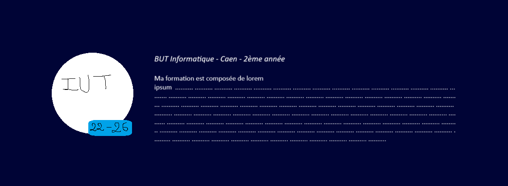

# Portfolio content

## Style

### Backgrounds
[Hero Patterns](https://heropatterns.com)

1. Topography
2. Texture
3. Hideout
4. Cages (beans)

### Fonts
[Google Fonts](https://fonts.google.com)

1. Serif : Merriweather
2. Sans-serif : Poppins

### Icons
[Heroicons](https://heroicons.com)

---

## Content

[International translation plugin](https://vue-i18n.intlify.dev/)

### Pages

1. Homepage
   1. Présentation rapide
   2. Formation
   3. Projets highlighted
   4. Compétences
2. Projects (all)
3. Alternance 2024
4. Contact

### Homepage
#### Présentation rapide

- Photo
Bonjour 👋
Je suis Julien Sailly, étudiant en BUT Informatique à Caen. Je suis passionné par le développement web et mobile, et je recherche actuellement une alternance pour septembre 2024 [_lien vers page alternance_].

#### Formation

- Logo IUT ou image campus (avec lien vers site + puce comme notifs iPhone indiquant la date de début et de fin)

#### Projets highlighted

Présentation sous forme de carte (image + titre + description + lien vers page projet)
Avec tri si possible (récent, alphabétique, pertinence)

Projets (classés par pertinence) :
- Nautilus
- Portfolio (ce site)
- Pti'Cuisto
- Instant-Weather
- JFA Bot
- Gribouille

#### Compétences

Compétences humaines (soft skills) :
- Autonome
- Curieux
- Créatif
- Dynamique

Compétences techniques (hard skills) :
- Développement WEB :
   - HTML/CSS/JS
   - Vue.js
   - Node.js
   - PHP (Laravel)
- Développement mobile :
   - Kotlin
   - Jetpack Compose
- Gestion de projet :
   - Git
   - Méthodes agiles
- Administration système :
   - Linux
   - Windows
- Gestion de bases de données :
   - MySQL
   - Oracle SQL
   - PL/SQL
- Langages de programmation :
   - Java
   - C/C#
   - Python
- Virtualisation :
   - Proxmox
   - Vagrant
   - Docker

Compétences transversales :
- Anglais
- Droit
- Gestion
- Communication

### Alternance 2024

